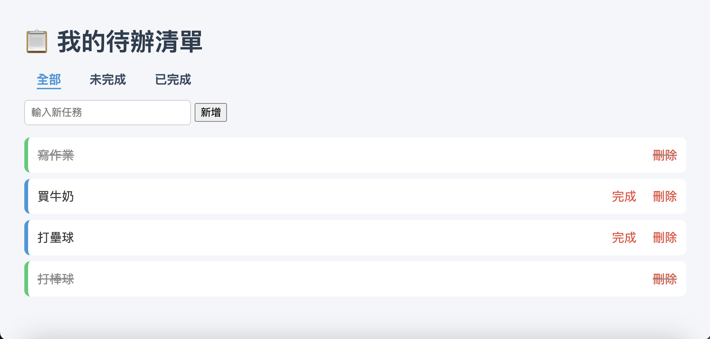

##  Flask To-Do App

一個使用 **Flask + PostgreSQL** 製作的待辦清單應用程式，支援新增、完成、刪除任務（軟刪除），並可依狀態切換「全部 / 已完成 / 未完成」任務。

---

##  功能特色

-  新增任務（含表單驗證）
-  完成 / 刪除任務（軟刪除）
-  任務狀態過濾（全部 / 已完成 / 未完成）
-  使用 Flask-WTF 驗證表單輸入
-  採用 Python OOP 架構撰寫
-  使用 PostgreSQL 資料庫存取
-  基本 CSS 美化介面

---

##  使用方式

```bash```
### 1. 建立虛擬環境並安裝套件
`python3 -m venv venv`

`source venv/bin/activate`

`pip install -r requirements.txt`

### 2. 建立資料庫（PostgreSQL）
### 請在 pgAdmin 建立名為 todo_db 的資料庫
### 然後執行以下 SQL 建立資料表與欄位：

CREATE TABLE tasks (  

    id SERIAL PRIMARY KEY,  
    
    title TEXT NOT NULL,  
    
    done BOOLEAN DEFAULT FALSE,  
    
    is_deleted BOOLEAN DEFAULT FALSE  
    
);

### 3. 啟動應用程式
`export FLASK_APP=app.py`

`flask run`


### 📸 預覽畫面

> 使用者可在首頁新增、完成、刪除任務，並依狀態切換任務分類。


